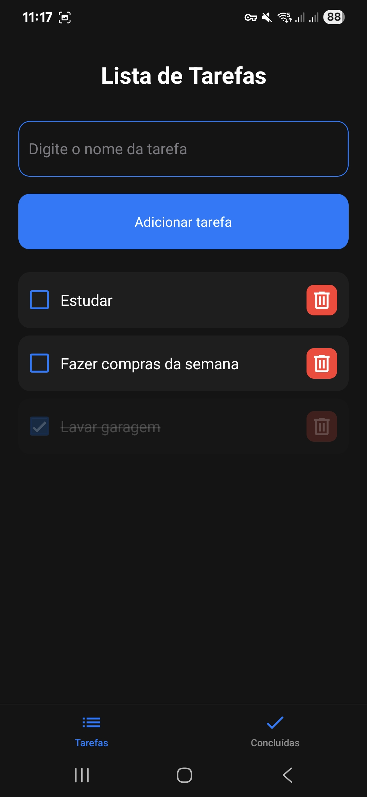

# To-Do List - Projeto UniMax - 3° Semestre.

- Tarefa:
  Crie uma aplicação de lista de tarefas onde o usuário possa adicionar novas tarefas.

### Requisitos:

- Marcar tarefas como concluidas e deletar tarefas.
- Utilize uma combinação de Checkbox e Listbox ou Combobox para gerenciar as tarefas.

Crie um componente TodoList onde o usuário pode adicionar uma tarefa atraves de um campo de texto. Cada tarefa será exibida em uma lista (Listbox ou Combobox).
Ao lado de cada tarefa, deve haver um Checkbox para marcar a tarefa como concluída. Adicione um botão para excluir uma tarefa da lista. Mostre uma lista separada de tarefas concluídas. Pesquisar sobre como gerenciar listas e iterar sobre arrays de objetos no React.

### Desafios:

Manter o estado de cada tarefa (completa ou não). Pesquisar sobre manipulação de listas de objetos em React, incluindo adição. remoção e alteracão de itens.

### Resultado:

  

